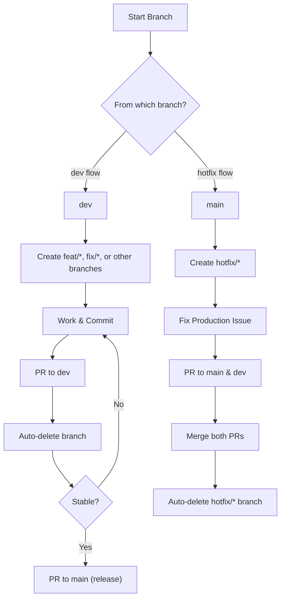

# Branch Strategy

This repository uses two main branching flows depending on the context:

- **Development flow** (based on `dev`)
- **Hotfix flow** (based on `main`)

Both `dev` and `main` are protected branches with the same ruleset applied.

## Branch Types

| Branch       | From   | Purpose |
|--------------|--------|---------|
| `dev`        | —      | Default branch. Active development happens here. |
| `main`       | —      | Stable release branch. Only updated via PRs. |
| `feat/*`     | `dev`  | New features. Merged into `dev` when complete. |
| `fix/*`      | `dev`  | Bugfixes or patches. Merged into `dev`. |
| `chore/*`    | `dev`  | Maintenance or configuration updates. |
| `refactor/*` | `dev`  | Internal code improvements without functional changes. |
| `test/*`     | `dev`  | Temporary or experimental work. |
| `hotfix/*`   | `main` | Emergency fixes for production. Merged into both `main` and `dev`. |

## 1. Development Flow (from `dev`)

1. Create a new branch from `dev` (e.g. `feat/*`, `fix/*`)
2. Work and commit changes
3. Open a PR to `dev`
4. After merge, the branch is auto-deleted
5. Once stable, open a PR from `dev` to `main` for release

## 2. Hotfix Flow (from `main`)

1. Create a `hotfix/*` branch from `main`
2. Apply the emergency fix
3. Open two pull requests:
   - One to merge into `main`
   - One to merge into `dev`
4. Merge the PR to `main` first
5. Then merge the PR to `dev`
6. After both PRs are merged, the `hotfix/*` branch will be automatically deleted

### Notes on Auto-deletion

- GitHub only auto-deletes a branch after a PR **if no other open PRs are using it**
- So if a `hotfix/*` branch is still referenced by another PR (e.g., to `dev`), it **will not be auto-deleted yet**
- Once both PRs are merged, the branch is deleted automatically

## Repository Settings

- ✅ `dev` is set as the **default branch**
- ✅ **Auto-delete merged branches** is enabled
- ✅ A shared **ruleset** is applied to both `main` and `dev`:
  - Require a pull request before merging
  - Block force pushes
  - Prevent branch deletion

## Visual Workflow

## Notes
- dev and main are both protected: cannot be force-pushed or deleted
- Only pull requests are allowed to modify these branches
- All `feature/fix/hotfix` branches are short-lived and auto-cleaned
